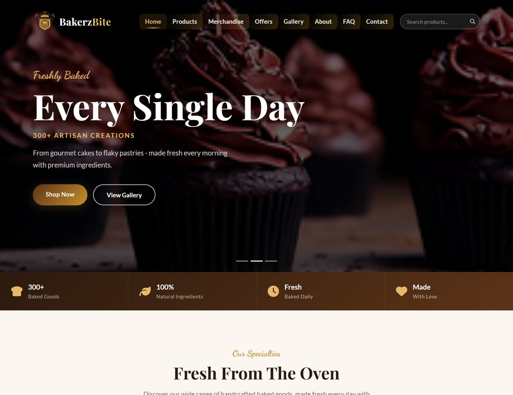
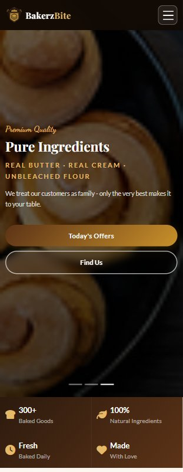

# Bakerz Bite

A responsive single-page bakery website built with HTML5, CSS3, and JavaScript.



---

## Live Demo

[https://aptech-bakery-project.vercel.app/](https://aptech-bakery-project.vercel.app/)

## Repository

[https://github.com/olowokandevincent/AptechBakeryProject](https://github.com/olowokandevincent/AptechBakeryProject)

---

## Local Preview

Open `index.html` with VS Code Live Server or any local HTTP server.  
> Note: Do **not** open via `file://` — the Fetch API will be blocked by CORS.

---

## Project Structure

```
Bakerz_Bite_Project/
├── index.html              # Main single-page application
├── css/
│   └── style.css           # All custom styles & design system
├── js/
│   └── main.js             # App logic, data rendering, interactions
├── data/
│   └── products.json       # Product, gallery, offer, FAQ data
├── assets/
│   └── images/             # Logo, hero slides, gallery, about, merch images
├── design/                 # Figma design screenshots & mockups
│   ├── desktopView.png
│   ├── mobileView.png
│   ├── tabletView.png
│   └── screencapture-figma-design-Bakerz-Bite.png
├── screenshoots/           # Browser screenshots (desktop + mobile)
│   ├── desktop-preview.jpg
│   ├── desktop.png
│   ├── mobile-preview.jpg
│   └── mobile.png
├── Report/
│   └── Project_Report.docx # Academic project report
├── README.md
└── LICENSE
```

---

## Tech Stack

| Technology | Purpose |
|---|---|
| HTML5 | Semantic markup, SPA structure |
| CSS3 | Custom design system, animations |
| JavaScript | All interactivity, no frameworks |
| Bootstrap 5.3.2 | Grid, components, utilities |
| Font Awesome 6.5 | Icons |
| AOS (Animate On Scroll) | Scroll-triggered animations |
| Google Fonts | Playfair Display, Lato, Dancing Script |

---

## Features

- **Preloader** — Logo bounce animation with progress bar
- **Hero Carousel** — 3-slide carousel with Ken Burns zoom effect
- **Product Catalogue** — Cakes, Pastries, Cookies, Pies loaded from `products.json`
- **Merchandise Section** — Branded merchandise items
- **Real-time Search** — Filters across product name, description, category, and tags
- **Category Filters** — All / Cakes / Pastries / Cookies / Pies / Bestsellers / New / Premium
- **Sort Controls** — Name A–Z, Name Z–A, Price Low–High, Price High–Low
- **Product Detail Modal** — Full product info with Order via WhatsApp button
- **Special Offers** — Promotional deal cards
- **Gallery** — Photo gallery with lightbox
- **About Section** — Bakery story and chef profile
- **Testimonials** — Customer reviews with star ratings
- **Feedback & Rating** — Interactive star rating form with validation
- **FAQ** — Accordion-style frequently asked questions
- **Contact Form** — Customer enquiry form
- **Newsletter** — Email subscription with Enter-key support
- **WhatsApp FAB** — Floating action button (scroll-triggered)
- **Bottom Ticker** — Real-time clock + HTML5 Geolocation
- **Visitor Counter** — localStorage-persisted visit tracking
- **Fully Responsive** — Mobile-first, tested on desktop and mobile

---

## Design System

| Token | Value |
|---|---|
| Primary (Dark Brown) | `#5C3317` |
| Gold | `#C8902A` |
| Cream Background | `#FBF7F0` |
| Card Border Radius | `18px` |
| Button Border Radius | `50px` |
| Transition | `cubic-bezier(0.4, 0, 0.2, 1)` |

---

## Mobile Preview



---

## Figma Design

Design mockups and wireframes are located in the [`design/`](design/) folder.

---

## Academic Context

This project is the **Semester 1 e-project** submitted to **Aptech Computer Education HQ**, demonstrating proficiency in HTML5, CSS3, and JavaScript to build a fully functional Single-Page Application (SPA) without relying on front-end frameworks.

Report: [`Report/Project_Report.docx`](Report/Project_Report.docx)

---

## License

This project is licensed under the MIT License — see [LICENSE](LICENSE) for details.
